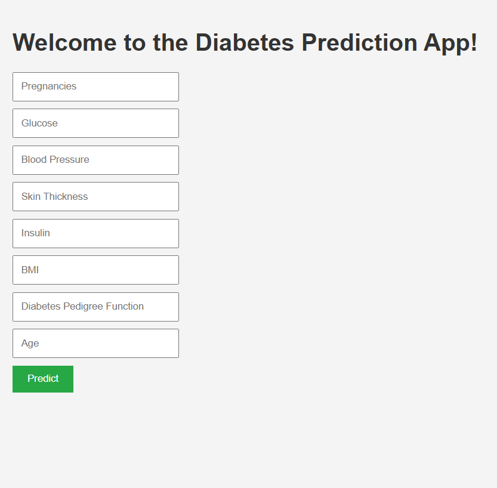

# 🩺 Diabetes Prediction Web App

An interactive web application that predicts whether a person is likely to have diabetes based on health-related inputs like glucose level, BMI, insulin, etc. This project uses a K-Nearest Neighbors (KNN) classifier and is built with **HTML, CSS, JavaScript**, and **Python (Flask)** for the backend.

## 🔍 Overview

- 🎯 **Goal**: Predict diabetes using user-provided health metrics.
- 🤖 **Model Used**: K-Nearest Neighbors (Best accuracy at K=1: 98%).
- 🌐 **Frontend**: HTML, CSS, JavaScript.
- 🧠 **Backend/ML**: Python, Flask, Scikit-learn.
- 📊 **Dataset**: [PIMA Diabetes Dataset](https://www.kaggle.com/datasets/uciml/pima-indians-diabetes-database)

## 🚀 Live Demo

[🔗Live Demo Link Here](https://diabetes-prediction-webapp-vc30.onrender.com/)

## 📸 Screenshots




## 📁 Project Structure


## 🧠 Features

- Takes user input from web form (Glucose, BMI, etc.)
- Predicts diabetes likelihood in real-time
- Clean, responsive UI
- Easy to understand and extend

## 🛠️ How to Run Locally

1. **Clone the Repository**  
```bash
git clone https://github.com/your-username/Diabetes-Prediction-WebApp.git
cd Diabetes-Prediction-WebApp
